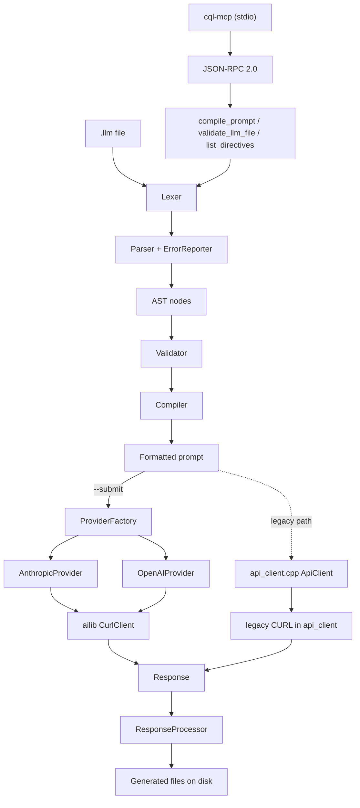

# CQL Architecture Review

**Reviewer:** Engineering analysis (RPC/architecture lead, with CI/CD and security leads)
**Date:** 2026-07-17
**Scope:** Full codebase — compiler pipeline, provider/HTTP layer, secrets, MCP server, templates, meta-prompt, build/CI.
**Basis:** Read of ~27k lines of non-test source + ~14k lines of tests; a clean warning-free build; the full suite run (291 tests) under normal and ASan/UBSan builds; an independent security audit.

> This is a critique, not a sales sheet. CQL is a genuinely capable, thoughtfully-structured
> codebase with a clear domain. The concerns below are what stand between it and being a tool
> other people can safely depend on.

---

## 1. Executive summary

CQL is a hand-written prompt compiler (`.llm` → structured prompt) plus a multi-provider AI
submission layer and an MCP server. The **compiler pipeline is the strongest part**: a clean
lexer → parser → AST → validator → compiler chain with panic-mode error recovery. The
**provider/HTTP layer is the weakest**: it carries two independent HTTP client implementations
with divergent behavior, a connection-pool that is initialized but never used, and an "async"
API that is serialized behind a single mutex.

The most important architectural finding is **duplication that has already produced a
regression**: the newer `ailib` HTTP client shipped without the HTTPS/redirect protections the
older `api_client.cpp` already had (fixed in this pass). Wherever the codebase maintains two
copies of a concept — two HTTP clients, two test harnesses, three directive lists — the copies
have drifted, and the drift is where the bugs live.

| Dimension | Assessment |
|---|---|
| Compiler pipeline design | **Strong** — clean stages, error recovery, good separation |
| Provider abstraction | **Good intent, unfinished** — factory + interface, but two clients coexist |
| Concurrency model (HTTP) | **Weak** — global mutex + dead connection pool; async is cosmetic |
| Secret handling | **Good intent, not upheld end-to-end** — SecureString leaks at the boundary |
| Single-source-of-truth discipline | **Weak** — directives, HTTP clients, and test harnesses are duplicated |
| Modularity (`ailib` extraction) | **Good** — the AI library is cleanly separable, except it reaches back for `project_utils` |
| Test & CI foundation | **Now solid** — was zero CI + mirage tests; now real CI + honest suite |

---

## 2. System overview

Note the two paths into an HTTP client (`HC1`, `HC2`) — see §4.1.

### Module map

| Area | Lines / files | Role |
|---|---|---|
| `src/cql/` | ~14,100 / 42 | Core compiler, CLI, response processing, logging, meta-prompt |
| `include/cql/` | ~8,700 / 41 | Public headers |
| `lib/ailib/` | ~3,950 / 16 | Standalone AI provider library (providers, HTTP, config, SecureString) |
| `src/mcp/` | ~470 / 7 | MCP JSON-RPC server |

---

## 3. Subsystem analysis

**Compiler pipeline (`lexer`/`parser`/`nodes`/`validator`/`compiler`)** — The best-designed
part. The lexer is a hand-written keyword scanner (`lex_keyword`), the parser uses a dispatch
table with panic-mode recovery (records an error, skips to the next `@` directive, reports all
errors together), and the compiler formats the AST into a prompt. Stages are cleanly separable
and independently comprehensible. **Concern:** the set of valid directives is hard-coded in the
lexer as an `if/else` chain and *re-hard-coded* in two other places (see §4.3).

**Provider/HTTP layer (`lib/ailib/providers`, `lib/ailib/http`, `src/cql/api_client.cpp`)** —
The intent is good: a `ProviderInterface` with a `ProviderFactory` and per-provider request/
response translation. The execution is unfinished — see §4.1 and §4.2 for the two-clients and
concurrency problems.

**Secret handling (`SecureString`, `SecureAllocator`)** — `SecureAllocator` is a correct,
careful implementation (mlock + `explicit_bzero`/`SecureZeroMemory`, platform-specific). But the
abstraction is not upheld at its boundary: `Config::get_api_key()` returns `std::string`, and
`SecureString::data()` copies the secret into a `static thread_local std::string`. The key
therefore spends most of its process lifetime in ordinary, unlocked, un-zeroed memory (§4.4).

**MCP / JSON-RPC server (`src/mcp`)** — Small and clean (JSON-RPC 2.0 over stdio, three tools).
It correctly reuses `QueryProcessor::compile` for `compile_prompt`. **Concerns:** unbounded
`std::getline` from stdin and unbounded JSON parse depth (a crafted payload can exhaust memory
or overflow the stack), and `validate_llm_file` skips the length guard its sibling tool gets for
free. This is the "RPC" surface and deserves the same input rigor as the compiler.

**Template system (`template_manager`, `template_validator`, `template_validator_schema`)** —
Inheritance, variables, and schema validation. Functional, but the valid-directive set is
duplicated here (§4.3) and inheritance-cycle handling relies on string-matching exception
messages (`error_msg.find("circular")`), which is brittle.

**Meta-prompt (`src/cql/meta_prompt/*`)** — Circuit breaker, cost controller, intelligent cache,
hybrid compiler. Ambitious resilience machinery, mostly exercised only through the LOCAL_ONLY
path and (until this pass) thinly tested. `handle_optimize_command` prints to `std::cout`
instead of the `UserOutputManager` the rest of the CLI uses (§4.5).

---

## 4. Architectural concerns (ranked)

### 4.1 Two HTTP client implementations coexist and have drifted — **highest priority**
`src/cql/api_client.cpp` (890 lines, legacy) and `lib/ailib/src/http/curl_client.cpp` (470 lines,
newer) are two full CURL-based HTTP clients. They are not layered — they are parallel. The
concrete cost already materialized: the legacy client set `CURLOPT_PROTOCOLS`/
`CURLOPT_REDIR_PROTOCOLS = CURLPROTO_HTTPS`; the newer ailib client did **not**, so the provider
path (the one the `@provider` directive uses) could send the API key over cleartext HTTP — a
security regression introduced purely by duplication. (Fixed in this pass, but the structural
cause remains.)
**Recommendation:** pick one (the ailib `ClientInterface` is the better abstraction), delete the
other, and route the legacy `ApiClient` through it. One HTTP client, one place to get TLS,
redirects, retries, and timeouts right.

### 4.2 The HTTP concurrency model is cosmetic
`CurlClient::send()` takes a `std::lock_guard` on a single `m_mutex` for the **entire** retry
loop, including `std::this_thread::sleep_for(delay)` between retries (`curl_client.cpp:308,366`).
`send_async()` is `std::async(...) → send()`, so every "async" request immediately serializes on
that mutex, and one request's backoff sleep blocks all others. Separately, the constructor
initializes a `curl_multi` handle and sets `CURLMOPT_MAXCONNECTS` for connection pooling
(`curl_client.cpp:157-164`), but `send()`/`send_stream()` use `curl_easy_perform()` on a fresh
easy handle and **never touch the multi handle** — the pool is dead code.
**Recommendation:** either implement real pooling/concurrency via the multi handle, or remove the
multi handle and document the client as synchronous; do not hold the mutex across `sleep_for`.

### 4.3 No single source of truth for the directive set
The list of valid directives is hard-coded in **three** places that have already drifted:
`Lexer::lex_keyword()` (21 directives), `TemplateValidator`'s `common_directives`
(was missing 9; fixed this pass), and `TemplateValidatorSchema::create_default_schema()` plus its
`unknown_directives` rule (still missing the same 9). Adding a directive requires editing all
three, and forgetting one produces exactly the false-positive/false-negative validation bugs
found in this review.
**Recommendation:** define the directive set once (e.g. a `directives.def` X-macro or a single
registry the lexer, validator, and schema all consume).

### 4.4 SecureString's guarantee is not upheld across the layer boundary
See §3. The storage primitive is correct; the *flow* is not. `get_api_key()` returns
`std::string`, `data()` copies into an unlocked thread-local, and the key is then cached in a
long-lived `default_headers` map inside the client. The advertised "memory-locked, zeroed"
property holds for the `SecureString` object and nothing downstream of it.
**Recommendation:** return/consume `SecureString` end-to-end; materialize the header value at the
last moment before `curl_easy_setopt`; do not cache key-bearing headers as long-lived members.

### 4.5 Inconsistent output routing
Most of the CLI writes through `UserOutputManager` (testable, redirectable). The meta-prompt
optimizer writes results straight to `std::cout`, which is why its integration test could not
capture output. Two output paths means two behaviors to reason about and test.
**Recommendation:** route all user-facing output through `UserOutputManager`.

### 4.6 Two test harnesses
A legacy `cql --test` runner (the `tests` vector + `run_tests`/`list_tests`) coexists with the
GoogleTest suite. The legacy runner registers `pass()` stub functions — it "runs" tests that
assert nothing. GoogleTest is the real suite.
**Recommendation:** remove the legacy `--test` harness (or wire it to real assertions); keep one
test system.

### 4.7 Config auto-discovery is an under-appreciated trust boundary
`Config::load_from_default_locations()` auto-reads `cql.config.json`/`~/.cql/config.json`,
including a provider `base_url`. A config file dropped into a cloned repo or a home directory
therefore influences where the API key is sent. This is a legitimate design choice, but it makes
config an input that must be validated (scheme, at minimum) like any other.

### 4.8 Minor: pervasive relative includes (`#include "../../include/cql/…"`)
Fragile and order-dependent; `<cql/…>` via the existing include dirs is cleaner. (The json
subset that broke `-Werror` was fixed this pass.)

---

## 5. Strengths worth preserving

- **The compiler pipeline** — clean, staged, with real error recovery. Don't let refactors erode
  the stage boundaries.
- **The `ailib` extraction** — a genuinely reusable AI-provider library is a strong asset; it just
  needs to stop reaching back into `cql` for `project_utils` to be truly standalone.
- **Security intent** — SecureString, input validation, HTTPS, key masking in logs
  (`anthropic.cpp:61` redacts `x-api-key`) show the right instincts; they need to be made real
  and consistent.
- **Modern C++20** — `std::ranges`, `string_view`, `[[nodiscard]]`, RAII cleanup structs are used
  idiomatically.

---

## 6. Prioritized recommendations

| Priority | Item | Effort |
|---|---|---|
| P0 | Consolidate to one HTTP client (§4.1) | M |
| P0 | Single directive registry (§4.3) | S |
| P1 | SecureString-typed key flow end-to-end (§4.4) | M |
| P1 | Fix HTTP concurrency: real pooling or honest sync; no sleep-under-lock (§4.2) | M |
| P1 | Enforce response-size limit at the read callback; harden generated-file writes (security work list SW4/SW5) | S–M |
| P2 | Remove the legacy `--test` harness (§4.6) | S |
| P2 | Route all output through `UserOutputManager` (§4.5) | S |
| P2 | Validate `base_url`/config inputs (§4.7, SW2) | S |
| P3 | Replace relative includes with `<cql/…>` (§4.8) | S |

---

## 7. What this hardening pass already changed

- Restored a warning-clean `-Werror` build across modern compilers; the build is now ASan/UBSan-clean.
- Added the project's first real build+test CI (Linux GCC + macOS AppleClang) and a sanitizer job.
- Fixed the directive-validation correctness bug (§4.3, partial) and added real tests for
  previously-untested/mirage-tested modules (template validator/schema, response processor, input
  validator); removed 9 assertion-free "mirage" tests; enabled the 1 disabled test.
- Fixed the cleartext-key-leak HTTP regression (§4.1) and corrected `SECURITY.md`'s false claims.

See `CHANGELOG.md` (the "Hardening & CI Pass" section) and `docs/OPEN_SOURCE_READINESS.md`.
