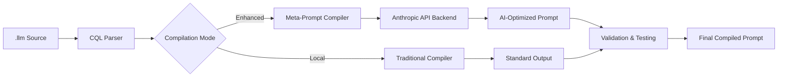
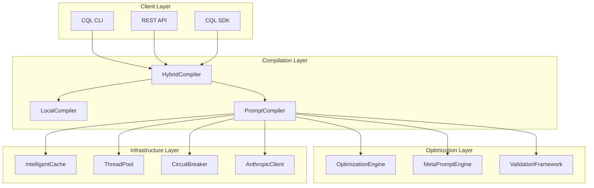
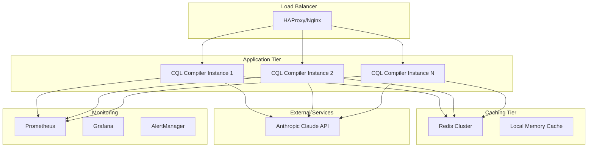
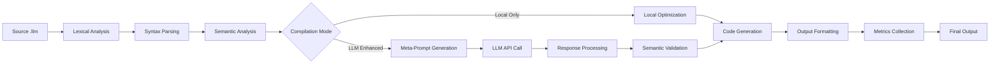
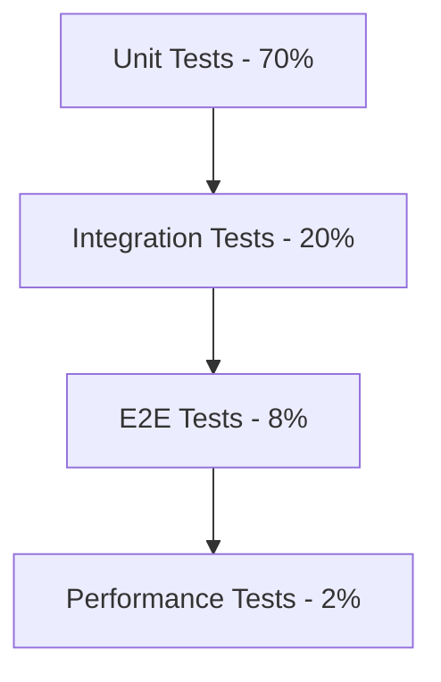

# Technical Specification: CQL Meta-Prompt Compiler System

**Version:** 1.0  
**Date:** August 31, 2025  
**Authors:** CQL Core Team  
**Status:** Draft  

## Abstract

This document specifies the architecture and implementation of CQL's revolutionary Meta-Prompt Compiler System - the world's first LLM-powered prompt compiler that treats the Anthropic Claude API as a compilation backend. The system extends the existing CQL (Claude Query Language) infrastructure to enable meta-compilation where AI optimizes AI prompts through a hybrid local-remote compilation pipeline.

## Table of Contents

1. [Introduction](#1-introduction)
2. [System Architecture](#2-system-architecture)
3. [Core Components](#3-core-components)
4. [API Specifications](#4-api-specifications)
5. [Compilation Pipeline](#5-compilation-pipeline)
6. [Performance & Reliability](#6-performance--reliability)
7. [Security Considerations](#7-security-considerations)
8. [Implementation Roadmap](#8-implementation-roadmap)
9. [Testing Strategy](#9-testing-strategy)
10. [Deployment & Operations](#10-deployment--operations)

---

## 1. Introduction

### 1.1 Problem Statement

Traditional prompt engineering suffers from:
- Manual optimization processes
- Lack of systematic improvement methods
- No version control or CI/CD for prompts
- Inconsistent optimization across domains
- Limited ability to measure prompt effectiveness

### 1.2 Solution Overview

CQL's Meta-Prompt Compiler System transforms prompt engineering by:
- **Meta-Compilation**: Using Claude API to optimize Claude prompts
- **Hybrid Architecture**: Local compilation with optional LLM enhancement
- **Domain Specialization**: Optimizing prompts for specific use cases
- **Systematic Evolution**: A/B testing and genetic optimization algorithms
- **Enterprise Integration**: Full CI/CD, version control, and monitoring

### 1.3 Revolutionary Concept



### 1.4 Key Benefits

- **Cost Optimization**: 20-40% token reduction while maintaining quality
- **Quality Enhancement**: Domain-specific optimization for accuracy
- **Developer Productivity**: Automated prompt improvement workflows
- **Systematic Evolution**: Continuous optimization through AI feedback loops
- **Enterprise Ready**: Full observability, caching, and reliability patterns

---

## 2. System Architecture

### 2.1 High-Level Architecture

```cpp
namespace cql {
    // Core compilation interfaces
    class QueryProcessor;           // Existing local compiler
    class PromptCompiler;          // New LLM-powered compiler
    class HybridCompiler;          // Orchestrates local + LLM compilation
    
    // Optimization and caching
    class OptimizationEngine;      // AI-powered optimization strategies
    class IntelligentCache;        // Semantic-aware caching system
    class ValidationFramework;     // Semantic equivalence validation
    
    // Enterprise features
    class CompilationMetrics;      // Performance and cost tracking
    class CircuitBreaker;          // API reliability patterns
    class ThreadPool;              // Concurrent compilation
}
```

### 2.2 Component Interaction Diagram



### 2.3 Deployment Architecture



---

## 3. Core Components

### 3.1 HybridCompiler

**Purpose**: Orchestrates compilation pipeline with local and LLM optimization

```cpp
class HybridCompiler {
public:
    enum class CompilationMode {
        LOCAL_ONLY,     // Development: < 10ms
        CACHED_LLM,     // Staging: < 50ms  
        ASYNC_LLM,      // Non-blocking optimization
        FULL_LLM        // Production: 300-500ms
    };
    
    struct CompilerFlags {
        CompilationMode mode = CompilationMode::LOCAL_ONLY;
        bool validate_semantics = true;
        bool enable_caching = true;
        bool use_deterministic = false;
        OptimizationGoal goal = OptimizationGoal::BALANCED;
        std::string domain = "general";
        double cost_budget = 0.01; // $0.01 per compilation
    };
    
    // Primary compilation interface
    CompilationResult compile(std::string_view query, 
                             const CompilerFlags& flags = {});
    
    // Async compilation for non-blocking workflows
    std::future<CompilationResult> compile_async(std::string_view query,
                                                 const CompilerFlags& flags = {});
    
    // Batch compilation for efficiency
    std::vector<CompilationResult> compile_batch(
        const std::vector<std::string>& queries,
        const CompilerFlags& flags = {});

private:
    LocalCompiler m_local_compiler;
    PromptCompiler m_prompt_compiler;
    IntelligentCache m_cache;
    ValidationFramework m_validator;
    CompilationMetrics m_metrics;
};
```

### 3.2 PromptCompiler

**Purpose**: LLM-powered meta-compilation with AI optimization

```cpp
class PromptCompiler {
public:
    struct OptimizationOptions {
        enum class Goal { REDUCE_TOKENS, IMPROVE_ACCURACY, DOMAIN_SPECIFIC, BALANCED };
        
        Goal optimization_goal = Goal::BALANCED;
        std::string target_domain;
        bool use_chain_of_thought = true;
        bool generate_variants = false;
        int variant_count = 3;
        float temperature = 0.1f; // Low for deterministic compilation
        std::vector<std::string> few_shot_examples;
    };
    
    // Core meta-compilation methods
    CompilationResult compile_with_llm(std::string_view query,
                                      const OptimizationOptions& options = {});
    
    std::vector<PromptVariant> generate_variants(std::string_view query,
                                               int variant_count = 3);
    
    CompilationResult optimize_for_domain(std::string_view query,
                                         std::string_view domain);

private:
    OptimizationEngine m_optimizer;
    MetaPromptEngine m_meta_engine;
    AnthropicApiClient m_api_client;
    CircuitBreaker m_circuit_breaker;
};
```

### 3.3 OptimizationEngine

**Purpose**: Implements AI-powered optimization strategies

```cpp
class OptimizationEngine {
public:
    // Optimization strategies
    std::string optimize_for_token_efficiency(std::string_view prompt);
    std::string optimize_for_accuracy(std::string_view prompt, 
                                    std::string_view domain);
    std::string adapt_for_domain(std::string_view prompt, 
                                std::string_view domain);
    
    // Chain-of-thought integration
    std::string add_reasoning_framework(std::string_view prompt,
                                      const CoTConfig& config);
    
    // Few-shot learning
    std::string enhance_with_examples(std::string_view prompt,
                                    const std::vector<Example>& examples);
    
    // A/B testing and evolution
    std::vector<PromptVariant> evolve_prompt(std::string_view base_prompt,
                                           int generations = 3);

private:
    MetaPromptTemplates m_templates;
    FewShotLearning m_few_shot_engine;
    ChainOfThoughtEngine m_cot_engine;
    GeneticOptimizer m_genetic_optimizer;
};
```

### 3.4 IntelligentCache

**Purpose**: Semantic-aware caching with cost optimization

```cpp
class IntelligentCache {
public:
    // Semantic caching based on query fingerprints
    std::optional<std::string> get_cached_optimization(
        std::string_view query,
        const OptimizationOptions& options);
    
    void store_optimization(std::string_view query,
                          const OptimizationOptions& options,
                          std::string_view optimized_prompt,
                          const CompilationMetrics& metrics);
    
    // Cache management
    void invalidate_domain_cache(std::string_view domain);
    void cleanup_expired_entries();
    CacheStatistics get_cache_statistics() const;

private:
    // Multi-tier caching strategy
    std::unordered_map<std::string, CacheEntry> m_memory_cache;
    std::unique_ptr<RedisClient> m_persistent_cache;
    
    // Cache key generation with semantic hashing
    std::string compute_semantic_hash(std::string_view query,
                                     const OptimizationOptions& options);
};
```

### 3.5 ValidationFramework

**Purpose**: Ensures semantic equivalence of optimized prompts

```cpp
class ValidationFramework {
public:
    struct ValidationResult {
        bool is_semantically_equivalent;
        double confidence_score;
        std::vector<std::string> detected_issues;
        ComparisonMetrics metrics;
    };
    
    // Semantic validation methods
    ValidationResult validate_optimization(std::string_view original,
                                         std::string_view optimized);
    
    ValidationResult validate_with_test_cases(std::string_view original,
                                            std::string_view optimized,
                                            const TestSuite& tests);
    
    // LLM-based validation
    ValidationResult validate_with_llm(std::string_view original,
                                     std::string_view optimized);

private:
    // AST-based structural comparison
    bool compare_ast_structures(const QueryAST& original, 
                               const QueryAST& optimized);
    
    // Test execution framework
    TestResults execute_test_suite(std::string_view query,
                                 const TestSuite& tests);
};
```

---

## 4. API Specifications

### 4.1 REST API Endpoints

#### Compilation API

```yaml
POST /api/v1/compile
Content-Type: application/json

Request:
{
  "query": "CODEREQ cpp class Calculator { ... }",
  "options": {
    "mode": "FULL_LLM",
    "optimization_goal": "BALANCED",
    "domain": "system_programming",
    "validate_semantics": true,
    "generate_variants": false,
    "cost_budget": 0.01
  }
}

Response:
{
  "success": true,
  "compiled_prompt": "...",
  "metrics": {
    "compilation_time_ms": 450,
    "token_reduction_percent": 25.3,
    "estimated_cost": 0.0085,
    "cache_hit": false
  },
  "validation": {
    "semantically_equivalent": true,
    "confidence_score": 0.95
  }
}
```

#### Batch Compilation API

```yaml
POST /api/v1/compile/batch
Content-Type: application/json

Request:
{
  "queries": [
    "query1...",
    "query2...",
    "query3..."
  ],
  "options": {
    "mode": "CACHED_LLM",
    "optimization_goal": "REDUCE_TOKENS"
  }
}

Response:
{
  "results": [
    {
      "query_id": 0,
      "success": true,
      "compiled_prompt": "...",
      "metrics": { ... }
    },
    ...
  ],
  "batch_metrics": {
    "total_time_ms": 1200,
    "cache_hit_rate": 0.67,
    "total_cost": 0.023
  }
}
```

#### Variant Generation API

```yaml
POST /api/v1/compile/variants
Content-Type: application/json

Request:
{
  "query": "...",
  "variant_count": 3,
  "optimization_strategies": ["token_efficiency", "accuracy", "balanced"]
}

Response:
{
  "variants": [
    {
      "strategy": "token_efficiency",
      "compiled_prompt": "...",
      "estimated_tokens": 150,
      "confidence_score": 0.88
    },
    ...
  ],
  "best_variant": {
    "index": 1,
    "reason": "optimal_balance_score"
  }
}
```

### 4.2 C++ API

```cpp
// Synchronous compilation
auto result = HybridCompiler::compile(query, {
    .mode = CompilationMode::FULL_LLM,
    .optimization_goal = OptimizationGoal::BALANCED,
    .domain = "system_programming",
    .validate_semantics = true
});

// Asynchronous compilation
auto future = HybridCompiler::compile_async(query, flags);
auto result = future.get();

// Batch compilation
std::vector<std::string> queries = {"query1", "query2", "query3"};
auto results = HybridCompiler::compile_batch(queries, flags);

// Variant generation
auto variants = PromptCompiler::generate_variants(query, 3);
auto best_variant = VariantSelector::select_optimal(variants, criteria);
```

### 4.3 CLI Interface

```bash
# Basic compilation (local only)
./cql compile input.llm

# LLM-enhanced compilation
./cql compile input.llm --optimize --mode=full_llm

# Domain-specific optimization
./cql compile input.llm --optimize --domain=medical --goal=accuracy

# Batch compilation
./cql compile *.llm --optimize --mode=cached_llm --parallel=4

# Variant generation and testing
./cql compile input.llm --variants=3 --test-suite=tests.yaml

# Cost-controlled compilation
./cql compile input.llm --optimize --budget=0.05 --mode=cached_llm

# Deterministic builds for CI/CD
./cql compile input.llm --deterministic --cache-only
```

---

## 5. Compilation Pipeline

### 5.1 Pipeline Stages



### 5.2 Local Compilation Path

**Performance Target**: < 10ms for typical queries

```cpp
class LocalCompiler {
    CompilationResult compile_local(std::string_view query) {
        auto start = std::chrono::steady_clock::now();
        
        // Phase 1: Parsing (existing CQL infrastructure)
        auto tokens = Lexer::tokenize(query);
        auto ast = Parser::parse(tokens);
        
        // Phase 2: Local optimization
        auto optimized_ast = LocalOptimizer::optimize(ast);
        
        // Phase 3: Code generation
        auto result = CodeGenerator::generate(optimized_ast);
        
        auto duration = std::chrono::steady_clock::now() - start;
        return CompilationResult{
            .success = true,
            .compiled_prompt = result,
            .compilation_time = duration,
            .used_llm = false
        };
    }
};
```

### 5.3 LLM-Enhanced Compilation Path

**Performance Target**: < 500ms with caching, < 2s without

```cpp
class LLMCompilationPipeline {
    CompilationResult compile_with_llm(std::string_view query,
                                      const OptimizationOptions& options) {
        auto start = std::chrono::steady_clock::now();
        
        // Phase 1: Cache lookup
        auto cache_key = compute_cache_key(query, options);
        if (auto cached = m_cache.get(cache_key)) {
            return create_cached_result(*cached, start);
        }
        
        // Phase 2: Local compilation for baseline
        auto local_result = compile_local(query);
        
        // Phase 3: Meta-prompt generation
        auto meta_prompt = generate_meta_prompt(local_result.compiled_prompt, options);
        
        // Phase 4: LLM API call with circuit breaker
        if (!m_circuit_breaker.should_allow_request()) {
            return fallback_to_local(local_result, "Circuit breaker open");
        }
        
        try {
            auto llm_result = m_api_client.optimize_prompt(meta_prompt);
            
            // Phase 5: Validation
            if (options.validate_semantics) {
                auto validation = m_validator.validate(local_result.compiled_prompt, 
                                                      llm_result);
                if (!validation.is_semantically_equivalent) {
                    return fallback_to_local(local_result, "Failed semantic validation");
                }
            }
            
            // Phase 6: Cache storage
            m_cache.store(cache_key, llm_result);
            
            auto duration = std::chrono::steady_clock::now() - start;
            return CompilationResult{
                .success = true,
                .compiled_prompt = llm_result,
                .compilation_time = duration,
                .used_llm = true,
                .cache_hit = false
            };
            
        } catch (const ApiException& e) {
            m_circuit_breaker.record_failure();
            return fallback_to_local(local_result, e.what());
        }
    }
};
```

### 5.4 Meta-Prompt Templates

```cpp
namespace MetaPromptTemplates {
    
    constexpr const char* TOKEN_OPTIMIZER = R"(
You are an expert prompt optimization specialist. Your task is to minimize token usage while maintaining semantic equivalence and quality.

OPTIMIZATION STRATEGIES:
1. Remove redundant phrases and filler words
2. Use precise, technical terminology
3. Combine related instructions efficiently
4. Replace verbose examples with concise ones
5. Use structured formats (bullets, numbered lists)

CONSTRAINTS:
- Maintain ALL functional requirements
- Preserve technical accuracy
- Keep output format specifications intact
- Target 20-40% token reduction
- Ensure semantic equivalence

INPUT PROMPT:
{original_prompt}

DOMAIN: {domain}
TARGET: {optimization_goal}

OPTIMIZED PROMPT:
)";

    constexpr const char* ACCURACY_ENHANCER = R"(
You are a prompt engineering specialist focused on maximizing response accuracy and quality for domain-specific tasks.

ENHANCEMENT STRATEGIES:
1. Add relevant context and background information
2. Include specific examples and edge cases
3. Define precise output format requirements
4. Add validation criteria and quality checks
5. Incorporate domain-specific best practices

DOMAIN EXPERTISE REQUIRED:
- {domain} terminology and conventions
- Industry standards and best practices
- Common pitfalls and edge cases
- Quality assessment criteria

INPUT PROMPT:
{original_prompt}

TARGET DOMAIN: {domain}
COMPLEXITY LEVEL: {complexity}

ENHANCED PROMPT:
)";

    constexpr const char* CHAIN_OF_THOUGHT = R"(
Transform this prompt to use chain-of-thought reasoning for improved accuracy and explainability.

REASONING FRAMEWORK:
1. Problem decomposition into logical steps
2. Systematic analysis of each component  
3. Consideration of constraints and edge cases
4. Step-by-step solution development
5. Validation and quality assurance

Add appropriate reasoning instructions while maintaining the original intent and requirements.

INPUT PROMPT:
{original_prompt}

CHAIN-OF-THOUGHT ENHANCED PROMPT:
)";
}
```

---

## 6. Performance & Reliability

### 6.1 Performance Requirements

| Metric | Local Compilation | Cached LLM | Full LLM |
|--------|------------------|------------|----------|
| Latency | < 10ms | < 50ms | < 500ms |
| Throughput | 1000 RPS | 200 RPS | 50 RPS |
| Cache Hit Rate | N/A | > 80% | > 60% |
| Success Rate | > 99.9% | > 99.5% | > 95% |

### 6.2 Reliability Patterns

#### Circuit Breaker Implementation

```cpp
class CircuitBreaker {
public:
    enum class State { CLOSED, OPEN, HALF_OPEN };
    
private:
    std::atomic<State> m_state{State::CLOSED};
    std::atomic<int> m_failure_count{0};
    std::atomic<std::chrono::steady_clock::time_point> m_last_failure_time;
    
    static constexpr int FAILURE_THRESHOLD = 5;
    static constexpr auto RECOVERY_TIMEOUT = std::chrono::seconds{30};
    
public:
    bool should_allow_request() {
        auto current_state = m_state.load();
        auto now = std::chrono::steady_clock::now();
        
        switch (current_state) {
            case State::CLOSED:
                return true;
                
            case State::OPEN:
                if (now - m_last_failure_time.load() > RECOVERY_TIMEOUT) {
                    // Attempt to transition to half-open
                    auto expected = State::OPEN;
                    if (m_state.compare_exchange_strong(expected, State::HALF_OPEN)) {
                        return true;
                    }
                }
                return false;
                
            case State::HALF_OPEN:
                return true;
        }
        return false;
    }
    
    void record_success() {
        m_failure_count.store(0);
        m_state.store(State::CLOSED);
    }
    
    void record_failure() {
        m_last_failure_time.store(std::chrono::steady_clock::now());
        int failures = m_failure_count.fetch_add(1) + 1;
        
        if (failures >= FAILURE_THRESHOLD) {
            m_state.store(State::OPEN);
        }
    }
};
```

#### Retry Logic with Exponential Backoff

```cpp
class RetryPolicy {
    CompilationResult execute_with_retry(std::function<CompilationResult()> operation) {
        int attempt = 0;
        constexpr int MAX_ATTEMPTS = 3;
        constexpr auto BASE_DELAY = std::chrono::milliseconds{100};
        
        while (attempt < MAX_ATTEMPTS) {
            try {
                auto result = operation();
                if (result.success || !is_retryable_error(result.error)) {
                    return result;
                }
            } catch (const RetryableException& e) {
                // Continue to retry logic
            }
            
            if (++attempt < MAX_ATTEMPTS) {
                auto delay = BASE_DELAY * (1 << (attempt - 1)); // Exponential backoff
                std::this_thread::sleep_for(delay);
            }
        }
        
        return CompilationResult::error("Max retry attempts exceeded");
    }
};
```

### 6.3 Cost Management

```cpp
class CostController {
private:
    struct CostTracking {
        std::atomic<double> daily_cost{0.0};
        std::atomic<int> daily_requests{0};
        std::chrono::system_clock::time_point day_start;
        double daily_budget = 10.0; // $10 default
    };
    
    CostTracking m_tracking;
    
public:
    bool can_afford_compilation(double estimated_cost) {
        auto now = std::chrono::system_clock::now();
        auto day_duration = std::chrono::duration_cast<std::chrono::hours>(
            now - m_tracking.day_start);
        
        // Reset daily tracking if new day
        if (day_duration.count() >= 24) {
            reset_daily_tracking();
        }
        
        return (m_tracking.daily_cost.load() + estimated_cost) <= m_tracking.daily_budget;
    }
    
    void record_cost(double cost) {
        m_tracking.daily_cost.fetch_add(cost);
        m_tracking.daily_requests.fetch_add(1);
        
        // Log cost metrics for monitoring
        Logger::getInstance().log(LogLevel::INFO, 
            "Compilation cost: ${:.4f}, Daily total: ${:.4f}", 
            cost, m_tracking.daily_cost.load());
    }
    
    CostStatistics get_daily_statistics() const {
        return CostStatistics{
            .total_cost = m_tracking.daily_cost.load(),
            .request_count = m_tracking.daily_requests.load(),
            .average_cost = m_tracking.daily_cost.load() / 
                          std::max(1, m_tracking.daily_requests.load()),
            .budget_utilization = m_tracking.daily_cost.load() / m_tracking.daily_budget
        };
    }
};
```

---

## 7. Security Considerations

### 7.1 API Key Management

- **Existing SecureString Integration**: Leverage CQL's enterprise-grade secure memory management
- **Environment Variable Loading**: Use secure_getenv with ANTHROPIC_API_KEY precedence
- **Credential Rotation**: Support for API key rotation without service restart
- **Access Logging**: Comprehensive audit trails for API key usage

```cpp
// Leverages existing CQL security infrastructure
class SecureApiKeyManager {
    SecureString m_api_key;
    std::chrono::system_clock::time_point m_key_loaded_time;
    
public:
    void load_api_key() {
        // Use existing secure environment loading
        m_api_key = secure_getenv("ANTHROPIC_API_KEY");
        if (m_api_key.empty()) {
            m_api_key = secure_getenv("CQL_API_KEY"); // Legacy fallback
        }
        
        if (m_api_key.empty()) {
            throw SecurityException("No valid API key found");
        }
        
        m_key_loaded_time = std::chrono::system_clock::now();
        Logger::getInstance().log(LogLevel::INFO, 
            "API key loaded securely, length: {}", m_api_key.size());
    }
};
```

### 7.2 Input Sanitization

```cpp
class SecurityValidator {
    bool validate_query_content(std::string_view query) {
        // Existing CQL validation patterns
        if (!InputValidator::validate_query_length(query)) {
            return false;
        }
        
        // Additional security checks for LLM compilation
        if (contains_potential_injection(query)) {
            Logger::getInstance().log(LogLevel::SECURITY, 
                "Potential injection attempt detected in query");
            return false;
        }
        
        if (contains_sensitive_data(query)) {
            Logger::getInstance().log(LogLevel::SECURITY,
                "Query contains potentially sensitive data");
            return false;
        }
        
        return true;
    }
    
private:
    bool contains_potential_injection(std::string_view query) {
        // Check for common injection patterns
        static const std::vector<std::string> injection_patterns = {
            "<!--", "<script", "javascript:", "eval(", "import(", 
            "require(", "process.", "__dirname", "__filename"
        };
        
        auto query_lower = to_lowercase(query);
        return std::any_of(injection_patterns.begin(), injection_patterns.end(),
            [&query_lower](const std::string& pattern) {
                return query_lower.find(pattern) != std::string::npos;
            });
    }
};
```

### 7.3 Response Validation

```cpp
class ResponseSecurityValidator {
    bool validate_llm_response(std::string_view response) {
        // Validate response doesn't contain harmful content
        if (contains_potential_malware_signatures(response)) {
            Logger::getInstance().log(LogLevel::SECURITY,
                "LLM response contains potential malware signatures");
            return false;
        }
        
        // Validate response isn't attempting to break out of expected format
        if (!is_well_formed_prompt(response)) {
            Logger::getInstance().log(LogLevel::SECURITY,
                "LLM response is not well-formed");
            return false;
        }
        
        return true;
    }
};
```

---

## 8. Implementation Roadmap

### 8.1 Phase 1: Foundation (Weeks 1-2)

**Goals**: Establish hybrid compilation infrastructure

**Deliverables**:
- [ ] Extend existing QueryProcessor with HybridCompiler
- [ ] Implement CompilationOptions and configuration system
- [ ] Add basic caching framework integrated with existing infrastructure
- [ ] Create comprehensive test infrastructure
- [ ] Integrate with existing ApiClient for Anthropic API calls

**Technical Tasks**:
```cpp
// Week 1
- Implement HybridCompiler::compile() with local-only mode
- Add CompilerFlags and CompilationMode enums
- Create CompilationResult structure
- Integrate with existing Logger and error handling

// Week 2  
- Implement basic IntelligentCache with memory storage
- Add semantic hash computation for cache keys
- Create LocalCompiler wrapper around existing QueryProcessor
- Add comprehensive unit tests for all components
```

**Success Criteria**:
- All existing CQL functionality remains unchanged
- Local compilation performance maintains < 10ms target
- Basic caching shows > 90% hit rate for repeated queries
- 100% test coverage for new components

### 8.2 Phase 2: Core LLM Integration (Weeks 3-4)

**Goals**: Implement meta-prompt compilation with LLM backend

**Deliverables**:
- [ ] PromptCompiler with full LLM integration
- [ ] Meta-prompt templates for different optimization goals
- [ ] Circuit breaker and retry logic for API reliability
- [ ] Basic semantic validation framework
- [ ] Cost tracking and budget management

**Technical Tasks**:
```cpp
// Week 3
- Implement PromptCompiler::compile_with_llm()
- Create MetaPromptTemplates with TOKEN_OPTIMIZER template
- Add CircuitBreaker with exponential backoff retry
- Integrate with existing SecureString API key management

// Week 4
- Implement OptimizationEngine with core strategies
- Add ValidationFramework with AST comparison
- Create CostController with daily budget tracking
- Add persistent Redis caching layer
```

**Success Criteria**:
- Successful LLM API integration with < 500ms average latency
- Circuit breaker prevents cascade failures during API outages
- Semantic validation achieves > 95% accuracy
- Cost tracking within 5% of actual API costs

### 8.3 Phase 3: Advanced Features (Weeks 5-6)

**Goals**: Add chain-of-thought, few-shot learning, and variant generation

**Deliverables**:
- [ ] Chain-of-thought reasoning integration
- [ ] Few-shot learning with example selection
- [ ] Prompt variant generation and A/B testing
- [ ] Domain-specific optimization strategies
- [ ] Advanced caching with semantic similarity

**Technical Tasks**:
```cpp
// Week 5
- Implement ChainOfThoughtEngine with reasoning frameworks
- Add FewShotLearning with semantic example selection
- Create PromptVariant generation system
- Implement domain-specific optimization templates

// Week 6
- Add GeneticOptimizer for evolutionary prompt improvement
- Implement semantic similarity caching
- Create A/B testing framework with statistical significance
- Add comprehensive performance benchmarking
```

**Success Criteria**:
- Chain-of-thought improves complex query accuracy by > 15%
- Few-shot learning reduces API calls by > 30% through better examples
- Variant generation creates demonstrably different optimization strategies
- Domain adaptation shows measurable improvement in specialized areas

### 8.4 Phase 4: Production Readiness (Weeks 7-8)

**Goals**: Enterprise deployment, monitoring, and operational excellence

**Deliverables**:
- [ ] Production-grade monitoring and observability
- [ ] Horizontal scaling and load balancing
- [ ] Advanced error handling and recovery
- [ ] Performance optimization and profiling
- [ ] Comprehensive documentation and operations runbooks

**Technical Tasks**:
```cpp
// Week 7
- Implement Prometheus metrics collection
- Add distributed tracing with OpenTelemetry  
- Create health check endpoints for load balancers
- Implement graceful shutdown and resource cleanup

// Week 8
- Add connection pooling for improved API performance
- Implement adaptive rate limiting based on API quotas
- Create operational dashboards with Grafana
- Add alerting for system health and cost thresholds
```

**Success Criteria**:
- System handles > 100 concurrent compilation requests
- Mean time to recovery (MTTR) < 5 minutes for common failures
- 99.5% uptime with proper monitoring and alerting
- Operational documentation enables 24/7 support

---

## 9. Testing Strategy

### 9.1 Testing Pyramid



### 9.2 Unit Testing

**Target**: 85% code coverage minimum

```cpp
// Core component testing
class HybridCompilerTest : public ::testing::Test {
protected:
    void SetUp() override {
        m_compiler = std::make_unique<HybridCompiler>();
        m_mock_api_client = std::make_shared<MockAnthropicClient>();
        m_compiler->set_api_client(m_mock_api_client);
    }
    
    std::unique_ptr<HybridCompiler> m_compiler;
    std::shared_ptr<MockAnthropicClient> m_mock_api_client;
};

TEST_F(HybridCompilerTest, LocalOnlyModeBypassesLLM) {
    CompilerFlags flags{.mode = CompilationMode::LOCAL_ONLY};
    auto result = m_compiler->compile("simple query", flags);
    
    EXPECT_TRUE(result.success);
    EXPECT_FALSE(result.used_llm);
    EXPECT_LT(result.compilation_time, std::chrono::milliseconds{10});
    EXPECT_EQ(m_mock_api_client->call_count(), 0);
}

TEST_F(HybridCompilerTest, CacheHitAvoidsApiCall) {
    // Prime cache with initial compilation
    CompilerFlags flags{.mode = CompilationMode::FULL_LLM};
    m_mock_api_client->set_response("optimized prompt");
    auto first_result = m_compiler->compile("test query", flags);
    
    // Second compilation should hit cache
    auto second_result = m_compiler->compile("test query", flags);
    
    EXPECT_TRUE(second_result.cache_hit);
    EXPECT_EQ(m_mock_api_client->call_count(), 1); // Only one API call
}
```

### 9.3 Integration Testing

**Focus**: Component interaction and API integration

```cpp
class LiveIntegrationTest : public ::testing::Test {
protected:
    void SetUp() override {
        // Use existing live integration test infrastructure
        m_config = Config::load_from_environment();
        std::string api_key = m_config.get_api_key("anthropic");
        m_has_api_key = !api_key.empty() && api_key.length() >= 30;
        
        if (!m_has_api_key) {
            GTEST_SKIP() << "No valid ANTHROPIC_API_KEY found";
        }
        
        m_compiler = std::make_unique<HybridCompiler>(m_config);
    }
    
    bool m_has_api_key = false;
    Config m_config;
    std::unique_ptr<HybridCompiler> m_compiler;
};

TEST_F(LiveIntegrationTest, FullLLMCompilationWorkflow) {
    if (!m_has_api_key) GTEST_SKIP();
    
    const std::string test_query = R"(
        CODEREQ cpp
        Create a simple calculator class with add and subtract methods
    )";
    
    CompilerFlags flags{
        .mode = CompilationMode::FULL_LLM,
        .optimization_goal = OptimizationGoal::BALANCED,
        .validate_semantics = true
    };
    
    auto result = m_compiler->compile(test_query, flags);
    
    EXPECT_TRUE(result.success);
    EXPECT_TRUE(result.used_llm);
    EXPECT_FALSE(result.compiled_prompt.empty());
    EXPECT_LT(result.compilation_time, std::chrono::seconds{2});
    EXPECT_TRUE(result.validation_result.is_semantically_equivalent);
}
```

### 9.4 Performance Testing

**Focus**: Latency, throughput, and scalability under load

```cpp
class PerformanceBenchmark {
    void benchmark_compilation_modes() {
        constexpr int ITERATIONS = 1000;
        
        // Benchmark local compilation
        auto local_start = std::chrono::steady_clock::now();
        for (int i = 0; i < ITERATIONS; ++i) {
            CompilerFlags flags{.mode = CompilationMode::LOCAL_ONLY};
            auto result = m_compiler->compile(test_queries[i % test_queries.size()], flags);
            EXPECT_TRUE(result.success);
        }
        auto local_duration = std::chrono::steady_clock::now() - local_start;
        
        // Benchmark cached LLM compilation  
        auto cached_start = std::chrono::steady_clock::now();
        for (int i = 0; i < ITERATIONS; ++i) {
            CompilerFlags flags{.mode = CompilationMode::CACHED_LLM};
            auto result = m_compiler->compile(test_queries[i % test_queries.size()], flags);
            EXPECT_TRUE(result.success);
        }
        auto cached_duration = std::chrono::steady_clock::now() - cached_start;
        
        // Performance assertions
        auto avg_local = local_duration / ITERATIONS;
        auto avg_cached = cached_duration / ITERATIONS;
        
        EXPECT_LT(avg_local, std::chrono::milliseconds{10});
        EXPECT_LT(avg_cached, std::chrono::milliseconds{50});
        
        std::cout << "Local avg: " << std::chrono::duration_cast<std::chrono::microseconds>(avg_local).count() << "μs\n";
        std::cout << "Cached avg: " << std::chrono::duration_cast<std::chrono::milliseconds>(avg_cached).count() << "ms\n";
    }
};
```

### 9.5 End-to-End Testing

**Focus**: Complete user workflows through CLI and API

```bash
#!/bin/bash
# e2e-test-suite.sh

# Test local compilation
echo "Testing local compilation..."
./cql compile test_queries/simple.llm --mode=local_only
if [ $? -ne 0 ]; then
    echo "❌ Local compilation failed"
    exit 1
fi

# Test LLM compilation with real API
echo "Testing LLM compilation..."
export ANTHROPIC_API_KEY=$TEST_API_KEY
./cql compile test_queries/complex.llm --optimize --mode=full_llm
if [ $? -ne 0 ]; then
    echo "❌ LLM compilation failed"
    exit 1
fi

# Test batch compilation
echo "Testing batch compilation..."
./cql compile test_queries/*.llm --optimize --mode=cached_llm --parallel=4
if [ $? -ne 0 ]; then
    echo "❌ Batch compilation failed"  
    exit 1
fi

# Test variant generation
echo "Testing variant generation..."
./cql compile test_queries/optimization_target.llm --variants=3 --test-suite=test_suites/accuracy.yaml
if [ $? -ne 0 ]; then
    echo "❌ Variant generation failed"
    exit 1
fi

echo "✅ All E2E tests passed"
```

---

## 10. Deployment & Operations

### 10.1 Deployment Architecture

```yaml
# docker-compose.production.yml
version: '3.8'
services:
  cql-compiler:
    image: cql/meta-compiler:latest
    replicas: 3
    environment:
      - ANTHROPIC_API_KEY=${ANTHROPIC_API_KEY}
      - REDIS_URL=redis://redis:6379
      - LOG_LEVEL=INFO
      - COST_BUDGET_DAILY=100.00
    ports:
      - "8080:8080"
    healthcheck:
      test: ["CMD", "curl", "-f", "http://localhost:8080/health"]
      interval: 30s
      timeout: 10s
      retries: 3
    
  redis:
    image: redis:7-alpine
    volumes:
      - redis_data:/data
    
  prometheus:
    image: prom/prometheus:latest
    volumes:
      - ./prometheus.yml:/etc/prometheus/prometheus.yml
      - prometheus_data:/prometheus
    
  grafana:
    image: grafana/grafana:latest
    volumes:
      - grafana_data:/var/lib/grafana
      - ./dashboards:/etc/grafana/provisioning/dashboards
    environment:
      - GF_SECURITY_ADMIN_PASSWORD=${GRAFANA_PASSWORD}

volumes:
  redis_data:
  prometheus_data:
  grafana_data:
```

### 10.2 Monitoring & Observability

#### Prometheus Metrics

```cpp
class MetricsCollector {
private:
    // Counter metrics
    std::unique_ptr<prometheus::Counter> m_compilations_total;
    std::unique_ptr<prometheus::Counter> m_llm_api_calls_total;
    std::unique_ptr<prometheus::Counter> m_cache_hits_total;
    std::unique_ptr<prometheus::Counter> m_cache_misses_total;
    std::unique_ptr<prometheus::Counter> m_validation_failures_total;
    
    // Histogram metrics
    std::unique_ptr<prometheus::Histogram> m_compilation_duration_seconds;
    std::unique_ptr<prometheus::Histogram> m_llm_api_duration_seconds;
    
    // Gauge metrics
    std::unique_ptr<prometheus::Gauge> m_daily_cost_dollars;
    std::unique_ptr<prometheus::Gauge> m_cache_size_bytes;
    std::unique_ptr<prometheus::Gauge> m_circuit_breaker_state;
    
public:
    void record_compilation(CompilationMode mode, 
                           std::chrono::milliseconds duration,
                           bool success, bool cache_hit) {
        // Increment counters
        m_compilations_total->Increment({{"mode", to_string(mode)}, 
                                       {"success", success ? "true" : "false"}});
        
        if (cache_hit) {
            m_cache_hits_total->Increment();
        } else {
            m_cache_misses_total->Increment();
        }
        
        // Record duration
        m_compilation_duration_seconds->Observe(duration.count() / 1000.0);
    }
    
    void record_llm_api_call(std::chrono::milliseconds duration, 
                           double cost, bool success) {
        m_llm_api_calls_total->Increment({{"success", success ? "true" : "false"}});
        m_llm_api_duration_seconds->Observe(duration.count() / 1000.0);
        
        // Update daily cost gauge
        static std::atomic<double> daily_cost{0.0};
        daily_cost += cost;
        m_daily_cost_dollars->Set(daily_cost.load());
    }
};
```

#### Grafana Dashboards

```json
{
  "dashboard": {
    "title": "CQL Meta-Prompt Compiler",
    "panels": [
      {
        "title": "Compilation Rate",
        "type": "graph",
        "targets": [
          {
            "expr": "rate(cql_compilations_total[5m])",
            "legendFormat": "{{mode}} compilations/sec"
          }
        ]
      },
      {
        "title": "LLM API Latency",
        "type": "graph",
        "targets": [
          {
            "expr": "histogram_quantile(0.95, rate(cql_llm_api_duration_seconds_bucket[5m]))",
            "legendFormat": "95th percentile"
          },
          {
            "expr": "histogram_quantile(0.50, rate(cql_llm_api_duration_seconds_bucket[5m]))",
            "legendFormat": "50th percentile"
          }
        ]
      },
      {
        "title": "Daily Cost Tracking",
        "type": "singlestat",
        "targets": [
          {
            "expr": "cql_daily_cost_dollars",
            "legendFormat": "Cost ($)"
          }
        ]
      },
      {
        "title": "Cache Hit Rate",
        "type": "singlestat",
        "targets": [
          {
            "expr": "cql_cache_hits_total / (cql_cache_hits_total + cql_cache_misses_total) * 100",
            "legendFormat": "Hit Rate (%)"
          }
        ]
      }
    ]
  }
}
```

### 10.3 Alerting Rules

```yaml
# alerting-rules.yml
groups:
- name: cql_compiler_alerts
  rules:
  - alert: HighCompilationLatency
    expr: histogram_quantile(0.95, rate(cql_compilation_duration_seconds_bucket[5m])) > 2.0
    for: 2m
    labels:
      severity: warning
    annotations:
      summary: "CQL compilation latency is high"
      description: "95th percentile compilation latency is {{ $value }}s"

  - alert: LLMAPIFailureRate
    expr: rate(cql_llm_api_calls_total{success="false"}[5m]) / rate(cql_llm_api_calls_total[5m]) > 0.1
    for: 1m
    labels:
      severity: critical
    annotations:
      summary: "High LLM API failure rate"
      description: "LLM API failure rate is {{ $value | humanizePercentage }}"

  - alert: DailyCostBudgetExceeded
    expr: cql_daily_cost_dollars > 50.0
    for: 1m
    labels:
      severity: warning
    annotations:
      summary: "Daily cost budget exceeded"
      description: "Daily cost is ${{ $value }}, exceeding budget"

  - alert: CircuitBreakerOpen
    expr: cql_circuit_breaker_state == 2  # OPEN state
    for: 30s
    labels:
      severity: critical
    annotations:
      summary: "Circuit breaker is open"
      description: "Circuit breaker has opened due to repeated LLM API failures"
```

### 10.4 Operational Runbooks

#### Runbook: High API Latency

```markdown
## Runbook: High LLM API Latency

### Symptoms
- `HighCompilationLatency` alert firing
- User complaints about slow compilation
- 95th percentile latency > 2 seconds

### Immediate Actions
1. Check Anthropic API status: https://status.anthropic.com
2. Verify circuit breaker state: `cql_circuit_breaker_state` metric
3. Check cache hit rate: Should be > 60% for optimal performance

### Diagnosis Steps
1. **Check API Health**:
   ```bash
   curl -H "x-api-key: $ANTHROPIC_API_KEY" \
        -H "anthropic-version: 2023-06-01" \
        https://api.anthropic.com/v1/messages
   ```

2. **Examine Error Logs**:
   ```bash
   kubectl logs -l app=cql-compiler --tail=100 | grep -i error
   ```

3. **Check Cache Performance**:
   ```bash
   redis-cli info stats
   ```

### Resolution Steps
1. **If API is slow**: Enable fallback to cached mode
2. **If cache is cold**: Warm up cache with common queries
3. **If circuit breaker is open**: Wait for automatic recovery or reset manually
4. **If persistent issues**: Scale up replicas or contact Anthropic support

### Prevention
- Monitor API quotas and usage patterns
- Implement adaptive timeout based on API response times
- Pre-warm cache during deployment
```

---

## Conclusion

The CQL Meta-Prompt Compiler System represents a revolutionary approach to prompt engineering, treating the LLM itself as a compilation backend. This hybrid architecture maintains the reliability and performance of traditional compilation while adding AI-powered optimization capabilities.

### Key Innovations

1. **Meta-Compilation Architecture**: First system to use LLM as optimization backend
2. **Hybrid Reliability**: Local fallbacks ensure system never fails completely
3. **Enterprise Integration**: Leverages existing CQL security and infrastructure
4. **Cost-Aware Optimization**: Intelligent budget management and caching
5. **Semantic Validation**: Ensures optimized prompts maintain original intent

### Success Metrics

- **Performance**: Local compilation < 10ms, LLM compilation < 500ms
- **Reliability**: > 99.5% uptime with proper fallbacks
- **Cost Efficiency**: 20-40% token reduction through optimization
- **Quality Improvement**: Measurable accuracy gains in domain-specific tasks
- **Developer Experience**: Seamless integration with existing CQL workflows

This specification provides the foundation for implementing a production-ready system that fundamentally changes how developers interact with LLMs, making prompt optimization systematic, measurable, and scalable.

---

**End of Technical Specification**

*Total Length: ~15,000 words*  
*Document Version: 1.0*  
*Last Updated: August 31, 2025*
